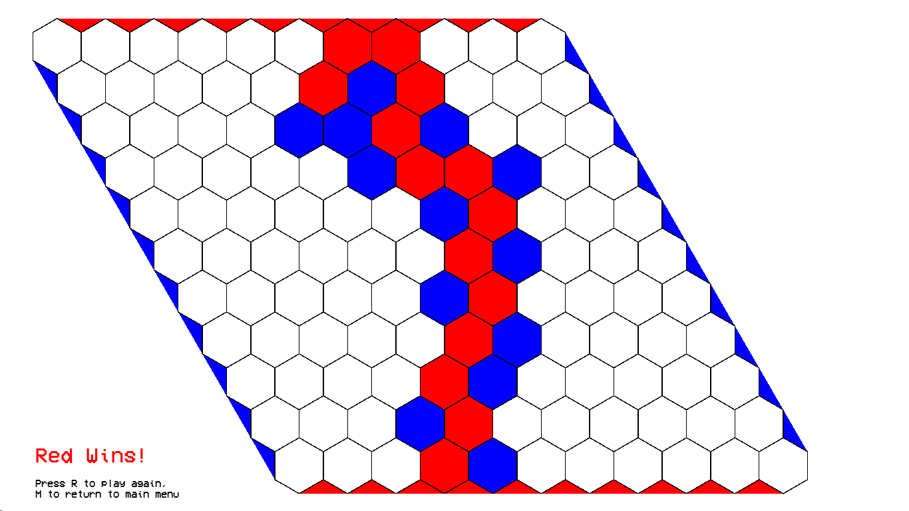
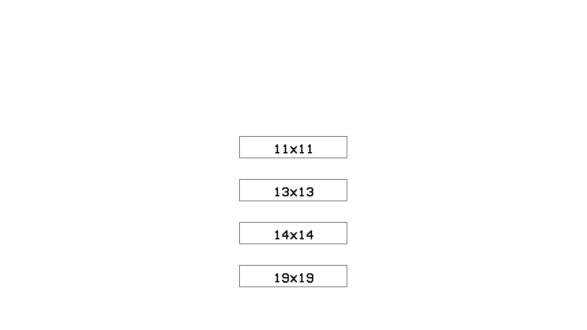

# chex-game
chex-game ("[the hex board game](https://en.wikipedia.org/wiki/Hex_(board_game)) written in C" or "crude hex game" depending on whom you ask) is my first relatively successful attempt at making a playable video game. I wrote it specifically to use the [union-find data structure](https://en.wikipedia.org/wiki/Disjoint-set_data_structure) as an exercise in applying data structures.

Note that this is not a hex engine (it does not include AI opponents).

## TODO
* swap rule?
* tidy up the code
* etc.

## Credit
* A huge thanks to the author of this [elegantly written guide](https://www.redblobgames.com/grids/hexagons/) about hexagonal grids
* Font is taken from https://www.dafont.com/vcr-osd-mono.font
* The [Allegro](https://liballeg.org/) game programming library
* This [coursera course](https://www.coursera.org/learn/algorithms-part1/) about algorithms and data structures

## Screenshots

